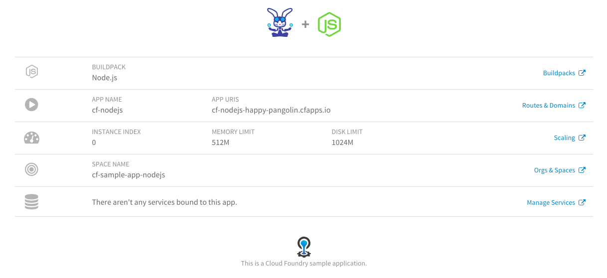

# TypeScript Sample App



This branch is approximately the same JavaScript/Node application from [samples `master` branch](https://github.com/cloudfoundry-samples/cf-sample-app-nodejs, rewritten in TypeScript.

During the rewrite, the deprecated/renamed `jade` library was upgraded to `pug`. The new application uses Yarn for package management of npm/`node_modules`. The `.js` and `app/*.js` source files can been moved into `src` and converted into `.ts` TypeScript.

## Dependencies

To install the application dependencies and their typescript descriptions:

```plain
yarn add express jade pug
yarn add @types/express --dev
yarn add @types/node --dev
```

To install `typescript` itself

```plain
yarn add typescript --dev
```

## Using TypeScript

To convert TypeScript `src/**/*.ts` files into JavaScript `built/**/*.js` files, run:

```plain
tsc
```

To watch `src/**/*.ts` files for changes and automatically convert:

```plain
tsc -w
```

## Run Locally

To run the application locally:

```plain
node built/server.js
```

## Deploy to Cloud Foundry

First, convert TypeScript `src/**/*.ts` files into JavaScript `built/**/*.js` files:

```plain
yarn
npm run-script build
```

Next, deploy to CF:

```plain
cf push
```

See the `manifest.yml` for configuration of a Node.JS application.

A random URL will be generated. Open it in the browser to see your TypeScript-authored, Node.JS-running, Cloud Foundry-hosted web application.